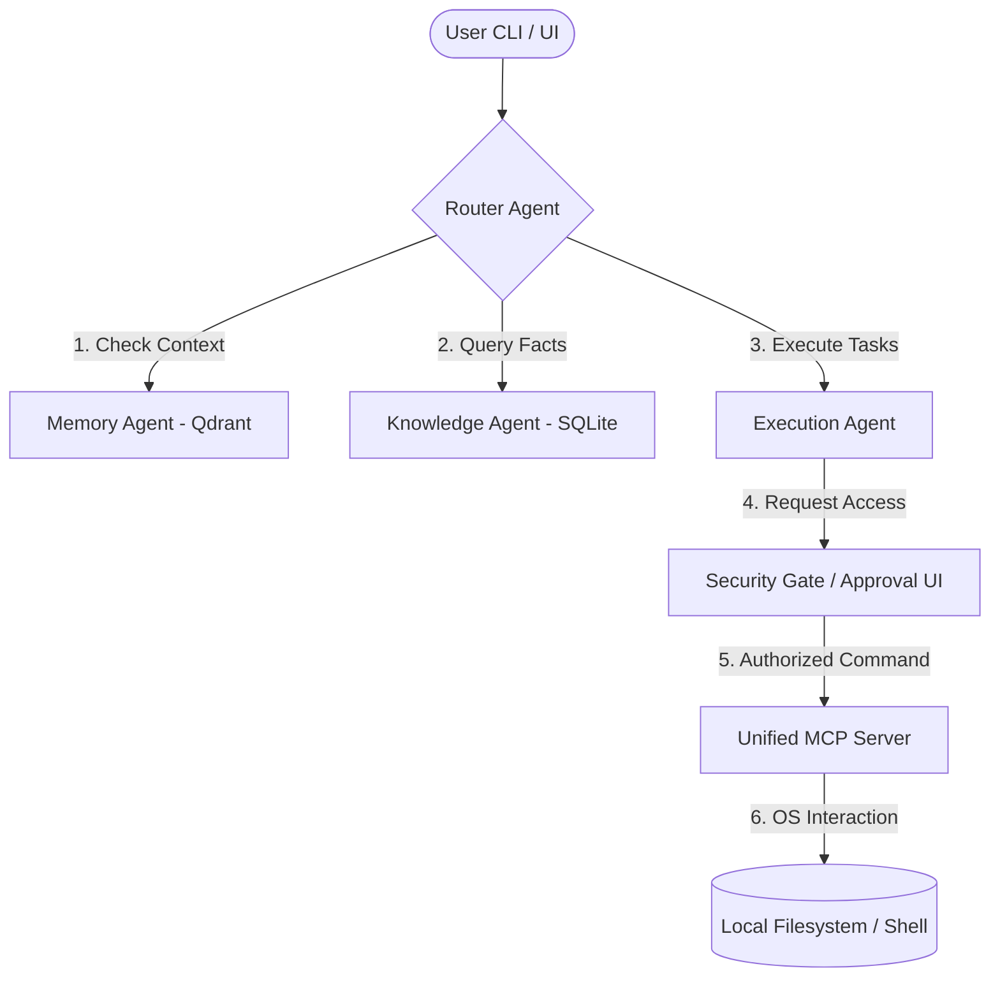

# Kaggle Capstone Project: Torvaix

Torvaix is a workspace-first, local-only, privacy-native AI operating system designed to give developers full control over their workflows, data, and models.

---

## 🎯 The Vision & Core Value Proposition

Most modern AI solutions send proprietary codebases, database secrets, and chat histories to remote cloud systems. Torvaix changes the paradigm by running a complete, multi-agent reasoning system and vector memory database **fully on your local machine**. It transforms conversations into structured knowledge, knowledge into persistent memory, and memory into automated tool execution.

### Key Features
- **🧠 Multi-Agent Orchestration**: A state-graph routing system that coordinates specialized agents:
  - **Router Agent**: Analyzes user intent and orchestrates control flow.
  - **Memory Agent**: Embeds and retrieves episodic/long-term context using Qdrant.
  - **Knowledge Agent**: Stores and queries factual/static data in SQLite.
  - **Execution Agent**: Interfaces with your local operating system via the Model Context Protocol (MCP).
- **🛡️ Native Security Sandbox**: A robust gateway requiring human-in-the-loop approvals for command-line operations (e.g. bash scripts or file edits) preventing autonomous agent runaway.
- **📚 Continuous Compound Memory**: A dual-database memory system (Qdrant + SQLite) ensuring context carries over indefinitely across workspaces.
- **🔌 Model Context Protocol (MCP)**: Native support for the MCP standard, decoupling tool servers from model-specific integration code.
- **⚡ Next-Generation UX**: Fully styled with Next.js 16, React 19, and Tailwind 4, offering glassmorphism dashboards, collapse-on-demand reasoning traces, and latency-aware telemetry.

---

## 🏗️ Architecture



---

## 📂 Repository Layout

- [packages/agent/src/agent-loop.ts](file:///Users/yashas/Torvaix/packages/agent/src/agent-loop.ts) — The main iterative reasoning loop.
- [packages/providers/src/index.ts](file:///Users/yashas/Torvaix/packages/providers/src/index.ts) — Dynamic LLM client configurations (Ollama/custom).
- [packages/router/src/index.ts](file:///Users/yashas/Torvaix/packages/router/src/index.ts) — State routing and task decomposition.
- [packages/agent/src/server.js](file:///Users/yashas/Torvaix/packages/agent/src/server.js) — Monorepo backend with WebSocket trace streaming.
- [apps/web/](file:///Users/yashas/Torvaix/apps/web) — The Next.js 16 premium user interface.
- [ROADMAP.md](file:///Users/yashas/Torvaix/ROADMAP.md) — Multi-phase product roadmap.
- [BENCHMARKS.md](file:///Users/yashas/Torvaix/BENCHMARKS.md) — Performance metrics.

---

## 🚀 Quick Setup & Run

1. **Install Dependencies**:
   ```bash
   npm install
   ```
2. **Start Ollama** (with `llama3.2` and `nomic-embed-text` models pulled).
3. **Run Dev Environment**:
   ```bash
   npm run dev
   ```
   *The development server will boot and serve the client at `http://localhost:3000`.*
4. **Execute Verification Test**:
   ```bash
   node test-agent-loop.js
   ```

---

*Torvaix makes AI local-first, privacy-native, and infinitely extensible.*
