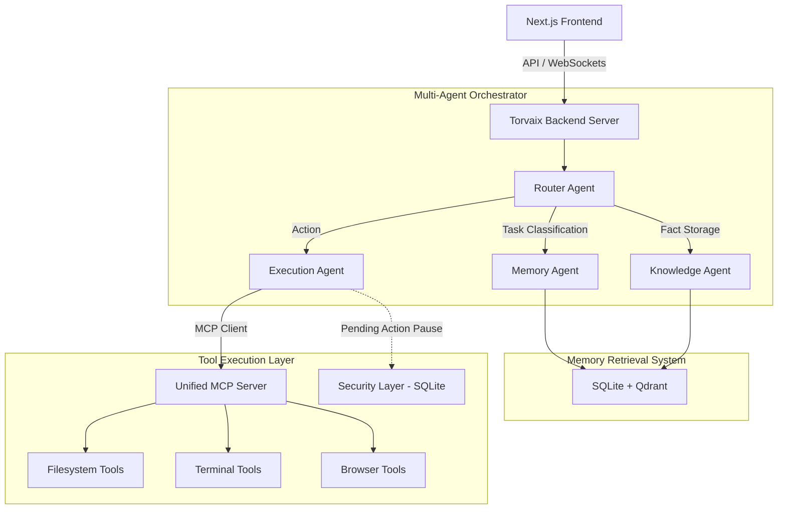

# Torvaix - Kaggle AI Agents Capstone

**A workspace-first AI operating system. Local-first, privacy-first, no telemetry.**

🌐 **Live Website:** [https://Yashasm18.github.io/Torvaix](https://Yashasm18.github.io/Torvaix)

---

## 🎯 Problem Statement

Most AI tools send your data to the cloud, locking you into a subscription and giving you zero control over how your information is used. Developers working with sensitive repositories, private APIs, or proprietary data cannot risk exposing their workspaces to external telemetry. 

**Torvaix** solves this by providing a self-hosted, workspace-first AI OS. Every model call, conversation, and execution happens entirely on your machine. Torvaix uses a powerful multi-agent graph, advanced memory retrieval (Qdrant), and the Model Context Protocol (MCP) to solve complex workflows autonomously, while introducing a strict Security Layer to require explicit user approval for dangerous actions.

---

## 🏗 Architecture Diagram

Torvaix is built with a sophisticated Multi-Agent Orchestrator communicating with a unified MCP server.



### Tech Stack
- **Frontend:** Next.js 16 (App Router), React 19, Tailwind CSS 4
- **State & Memory:** Qdrant (Vector DB), SQLite (Relational State)
- **Agent Orchestrator:** Custom State Graph, Vercel AI SDK
- **MCP Integration:** `@modelcontextprotocol/sdk` (Unified Server & Client)

---

## 🚀 Setup Instructions

### Prerequisites
- Node.js 18+
- npm 9+
- [Ollama](https://ollama.ai) (Ensure `llama3.2` and `nomic-embed-text` are pulled)
- Docker (Optional, for running Qdrant independently if preferred, but local DB works out of the box).

### Installation
```bash
git clone https://github.com/Yashasm18/Torvaix.git
cd Torvaix
npm install
```

---

## 💻 Localhost Run Instructions

Torvaix is designed for a seamless local developer experience.

```bash
# 1. Install dependencies
npm install

# 2. Start all services
npm run dev
```

> **What happens?** The Agent Server and Next.js Frontend will start simultaneously. Once ready, your default browser will automatically open to `http://localhost:3000`. If port 3000 is occupied, the startup will fail safely instead of silently switching ports.

**Prerequisites to check before running:**
1. Ensure Ollama is running (`ollama serve`).
2. If using Qdrant via Docker, ensure it's up. Otherwise, it falls back to SQLite.

---

## 🎬 Demo Flow

To demonstrate the full capabilities of Torvaix for the Capstone:

1. **Workspace Creation**: Create a new workspace in the UI. 
2. **Knowledge Storage**: Tell the agent "My favorite framework is Next.js". The **Router Agent** will route this to the **Knowledge Agent**, which generates embeddings and stores it in Qdrant + SQLite.
3. **Memory Retrieval**: Start a new chat and ask "What is my favorite framework?". The **Router Agent** will route to the **Memory Agent**, retrieving the correct answer from Qdrant.
4. **Tool Execution & MCP**: Ask the agent to "Create a Python script that calculates fibonacci and run it".
5. **Security Layer**: The **Execution Agent** will attempt to run `python`. It will pause execution, log a `pending_action`, and wait. The UI will prompt you to approve the action.
6. **Approval & Resume**: Click "Approve". The Execution Agent resumes, communicates with the **Unified MCP Server**, runs the script, and returns the output to the chat.

---

## 🐳 Docker (Qdrant Vector Database)

Torvaix uses Qdrant for semantic vector search. Start it with Docker:

```bash
# Pull and start Qdrant
docker run -d --name torvaix-qdrant -p 6333:6333 -p 6334:6334 qdrant/qdrant

# Verify Qdrant is running
curl http://localhost:6333/healthz
```

> **Note:** If Docker/Qdrant is unavailable, Torvaix automatically falls back to SQLite-based keyword search. No data is lost.

---

## 🧪 Verification Commands

Run these against the Agent Server (port 3001) to verify all systems:

```bash
# Health Check
curl http://localhost:3001/api/health

# Store a memory
curl -X POST http://localhost:3001/api/memory/store \
  -H "Content-Type: application/json" \
  -d '{"workspaceId":"default","content":"My favorite language is Python","source":"test"}'

# Retrieve memory (semantic search)
curl -X POST http://localhost:3001/api/memory/query \
  -H "Content-Type: application/json" \
  -d '{"workspaceId":"default","query":"What language do I prefer?","topK":3}'

# Execute via agent (triggers security layer for bash/python)
curl -X POST http://localhost:3001/api/agent/run \
  -H "Content-Type: application/json" \
  -d '{"workspaceId":"default","instructions":"Use bash to echo hello world"}'
```

---

## 🏆 Kaggle Proof of Concepts

Torvaix is built to demonstrate production-grade agentic AI. Below is a detailed mapping of each evaluation rubric item to the Torvaix implementation.

| Rubric Item | Torvaix Implementation | Key Files |
|---|---|---|
| **Multi-Agent System** | Custom State Graph Orchestrator with 4 specialized agents (Router, Memory, Knowledge, Execution). No LangGraph or framework dependency — pure TypeScript state machine with explicit transitions. | `packages/agent/src/orchestrator.ts` |
| **MCP Integration** | Unified MCP Server exposing filesystem, terminal, and browser tools. Execution Agent connects as MCP Client via `StdioClientTransport`. Demonstrates the full MCP protocol lifecycle. | `packages/mcp/src/index.ts` |
| **Tool Execution** | 5 tools (`read_file`, `write_file`, `bash`, `python`, `web_search`) exposed via MCP. The Execution Agent dynamically selects tools, executes them, and loops for multi-step tasks. | `packages/mcp/src/index.ts`, `packages/agent/src/orchestrator.ts` |
| **Security Layer** | Human-in-the-loop approval for dangerous operations (`bash`, `python`). Pending actions stored in SQLite with status tracking (`pending` → `approved`/`rejected`). Agent execution pauses until approval. | `packages/agent/src/orchestrator.ts`, `packages/memory/src/index.ts` |
| **Memory Retrieval** | Dual-layer memory: Qdrant (vector embeddings via `nomic-embed-text`) + SQLite (metadata, keyword fallback). Semantic similarity search with configurable `topK`. | `packages/memory/src/index.ts` |
| **Deployability** | Full Docker support for Qdrant. Single `npm install && npm run dev` startup. GitHub Actions CI/CD. Static landing page deployed via GitHub Pages. | `docker-compose.yml`, `.github/workflows/` |
| **Local Reproducibility** | Zero cloud dependencies. All models via Ollama (local). All storage via SQLite + Qdrant (local Docker). Works offline after initial model pull. | Root `README.md` |

### Architecture Proof

```
User Request
    ↓
[Next.js Frontend] ──→ [API Route /api/chat]
    ↓
[Agent Server :3001] ──→ [Router Agent] (LLM classification)
    ↓                         ↓                ↓
[Memory Agent]         [Knowledge Agent]  [Execution Agent]
    ↓                         ↓                ↓
[Qdrant + SQLite]      [Qdrant + SQLite]  [MCP Client]
                                               ↓
                                          [MCP Server]
                                          ├── read_file
                                          ├── write_file
                                          ├── bash ──→ 🛡️ Security Layer
                                          ├── python ──→ 🛡️ Security Layer
                                          └── web_search
```

---

## License
MIT. See [LICENSE](./LICENSE) for details.

**Torvaix** — Yours for the voyage.
