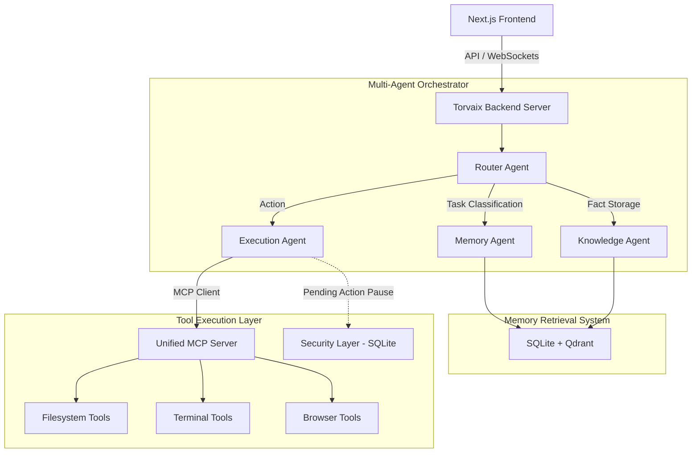

<div align="center">
  
<h1>
  
  &nbsp;Torvaix
</h1>

**A workspace-first AI operating system for memory, agents, knowledge, and execution.**

[](#)
[](#)
[](#)
[](#)
[](#)
[](#)
[](#)

<br />
<p align="center">
  <a href="#-quick-start">Quick Start</a> ·
  <a href="SETUP.md">Setup Guide</a> ·
  <a href="CONTRIBUTING.md">Contributing</a> ·
  <a href="ROADMAP.md">Roadmap</a>
</p>

*Your data belongs to you. Keep it that way.*

</div>

---

## 🎯 The Problem

Most AI tools send your data to the cloud, locking you into a subscription and giving you zero control over how your information is used. Developers working with sensitive repositories, private APIs, or proprietary data **cannot risk** exposing their workspaces to external telemetry. 

**Torvaix** solves this by providing a self-hosted, workspace-first AI OS. Every model call, conversation, and execution happens entirely on your machine. 

## ✨ Key Features

- **🧠 Multi-Agent Orchestration**: A custom state-graph routing system with specialized agents (Router, Memory, Knowledge, Execution).
- **🛡️ Native Security Layer**: Human-in-the-loop approval UI for dangerous operations (like `bash` scripts or system file deletion).
- **📚 Infinite Memory**: Dual-layer vector memory system powered by Qdrant embeddings and SQLite fallback.
- **🔌 Model Context Protocol (MCP)**: Native integration with the MCP standard, connecting the Execution Agent to local filesystem, terminal, and browser tools.
- **⚡ Premium UI/UX**: Built with Next.js 16, React 19, and Tailwind 4, featuring dynamic animations and glassmorphism.

---

## 🏗 System Architecture

Torvaix is built with a sophisticated Multi-Agent Orchestrator communicating with a unified MCP server.



---

## 🚀 Quick Start

Torvaix is designed for a seamless local developer experience.

### 1. Prerequisites
- **Node.js** 18+ & **npm** 9+
- **[Ollama](https://ollama.ai)** (Ensure `llama3.2` and `nomic-embed-text` are pulled)
- **Docker** *(Optional, for running Qdrant independently if preferred. Local SQLite works out of the box).*

### 2. Installation
```bash
git clone https://github.com/Yashasm18/Torvaix.git
cd Torvaix
npm install
```

### 3. Run Locally
```bash
# Start the Torvaix OS
npm run dev
```

> **What happens?** The Agent Server and Next.js Frontend will start simultaneously. Once ready, your default browser will automatically open to `http://localhost:3000`.

---

## 🎬 Demo Capabilities

To demonstrate the full capabilities of Torvaix for the Kaggle Capstone:

1. **Workspace Creation**: Create a new workspace in the UI. 
2. **Knowledge Storage**: Tell the agent *"My favorite framework is Next.js"*. The **Router Agent** will route this to the **Knowledge Agent**, which generates embeddings and stores it in Qdrant + SQLite.
3. **Memory Retrieval**: Start a new chat and ask *"What is my favorite framework?"*. The **Router Agent** will route to the **Memory Agent**, retrieving the correct answer from Qdrant.
4. **Tool Execution & MCP**: Ask the agent to *"Create a Python script that calculates fibonacci and run it"*.
5. **Security Layer**: The **Execution Agent** will attempt to run `python`. It will pause execution, log a `pending_action`, and wait. The premium UI card will prompt you to approve the action.
6. **Approval & Resume**: Click **Approve**. The Execution Agent resumes, communicates with the **Unified MCP Server**, runs the script safely, and streams the output directly into the chat.

---

## 🧪 Advanced: Backend APIs

Run these against the Agent Server (port 3001) to verify all systems:

```bash
# Health Check
curl http://localhost:3001/api/health

# Store a memory
curl -X POST http://localhost:3001/api/memory/store \
  -H "Content-Type: application/json" \
  -d '{"workspaceId":"default","content":"My favorite language is Python","source":"test"}'

# Retrieve memory (semantic search)
curl -X POST http://localhost:3001/api/memory/query \
  -H "Content-Type: application/json" \
  -d '{"workspaceId":"default","query":"What language do I prefer?","topK":3}'

# Execute via agent (triggers security layer for bash/python)
curl -X POST http://localhost:3001/api/agent/run \
  -H "Content-Type: application/json" \
  -d '{"workspaceId":"default","instructions":"Use bash to echo hello world"}'
```

---

## License

Torvaix is licensed under the [GNU Affero General Public License v3.0](LICENSE).

If you run a modified version of Torvaix over a network, you must make the modified source code available to users under the same license.

---

<div align="center">
  <p><b>Torvaix</b> — Yours for the voyage.</p>
</div>
