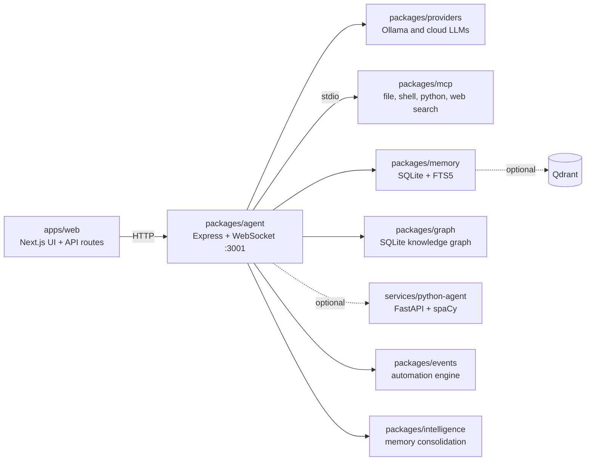

<div align="center">


# Torvaix

A self-hosted AI workspace with long-term memory, a knowledge graph, and tool use that asks before it runs code.

[](https://github.com/Yashasm18/Torvaix/actions/workflows/ci.yml)
[](https://github.com/Yashasm18/Torvaix/actions/workflows/codeql.yml)
[](LICENSE)

[Getting started](#getting-started) · [Configuration](#configuration) · [Architecture](#architecture) · [Contributing](CONTRIBUTING.md) · [Security](SECURITY.md)

</div>

---

Torvaix runs on your own machine. You chat with an agent that remembers what you've told it, organises those facts into a per-workspace knowledge graph, and can read files, search the web, and run shell or Python commands in a workspace folder. Shell and Python commands always wait for your approval.

It's built for local models through [Ollama](https://ollama.com). Cloud providers are optional, and nothing leaves your machine unless you configure one or use web search.

> **Status:** early and under active development (v0.3). Expect breaking changes. It's designed for a single user on their own computer, not as a shared or internet-facing service. See [SECURITY.md](SECURITY.md).

## Features

- **Chat with memory.** Facts you share are stored per workspace and recalled in later conversations. Retrieval combines keyword search (SQLite FTS5) with vector search (Qdrant) when Qdrant is available.
- **Knowledge graph.** Entities and relationships are extracted from stored memories and shown in an interactive graph, scoped to each workspace.
- **Tool use with approval.** The agent can read and write files inside the workspace folder, search the web, and scan a repository. `bash` and `python` commands pause until you approve them. An approval lasts 5 minutes for that tool in that workspace.
- **Automations.** Run workflows on a schedule (interval, hourly, daily, weekly), on events such as a new memory, or manually.
- **Memory consolidation.** Finds duplicate and related memories, scores them, and groups them into themes.
- **Agent trace.** Each reply shows how the request was routed, what was retrieved, and how long each tool call took.
- **Multiple model providers.** Ollama by default. OpenAI, Anthropic, Google, Groq and OpenRouter work when you add an API key.

## Getting started

### Requirements

- Node.js 22 or newer, with npm
- [Ollama](https://ollama.com) running locally
- Optional: Docker, for Qdrant (vector search) and the Python NLP service

### 1. Pull the models

```bash
ollama pull llama3.2
```

```bash
ollama pull nomic-embed-text
```

Any installed chat model works. If `TORVAIX_MODEL` isn't set, Torvaix uses an installed variant (for example `llama3.2:3b`). The **Intelligence** page shows which models are installed and what's missing.

### 2. Install

```bash
git clone https://github.com/Yashasm18/Torvaix.git
cd Torvaix
npm install
cp .env.example .env
```

### 3. Optional: start Qdrant

Without Qdrant, memory search falls back to keyword matching, which still works but is less accurate.

```bash
docker compose up -d qdrant
```

### 4. Run

```bash
npm run dev
```

This starts the agent server on `127.0.0.1:3001` and the web app on port 3000. Open <http://localhost:3000>, or run `npm run dev:open` to start both and open the browser for you.

### Production build

```bash
npm run build
npm start
```

### Docker

`docker compose up -d` builds and starts the whole stack: Qdrant, Ollama (which pulls `llama3.2` and `nomic-embed-text` on first start), the Python NLP service and the app. The first build and model download take a while. The web app is published on port 3000.

## Configuration

Copy `.env.example` to `.env`. Every setting is optional.

| Variable | Default | Purpose |
| --- | --- | --- |
| `TORVAIX_HOME` | `~/.torvaix` | Where databases (`data/`) and workspace folders (`workspaces/`) are stored |
| `TORVAIX_MODEL` | an installed Ollama model | Chat model ID, local or cloud |
| `OLLAMA_URL` | `http://localhost:11434` | Ollama endpoint |
| `QDRANT_URL` | `http://localhost:6333` | Qdrant endpoint |
| `PYTHON_SERVICE_URL` | `http://localhost:8000` | Optional NLP service for entity extraction |
| `AGENT_PORT` / `AGENT_HOST` | `3001` / `127.0.0.1` | Agent server address. Keep it on loopback. |
| `AGENT_SERVER_URL` | `http://localhost:3001` | Where the web app sends requests for the agent |
| `AGENT_ALLOWED_ORIGINS` / `AGENT_ALLOWED_HOSTS` | localhost only | Extra origins or hosts the agent accepts |
| `OPENAI_API_KEY`, `ANTHROPIC_API_KEY`, `GOOGLE_API_KEY`, `GROQ_API_KEY`, `OPENROUTER_API_KEY` | none | Enable cloud providers |
| `JWT_SECRET` | dev value | Signs login tokens (see [SECURITY.md](SECURITY.md)) |

If `OPENAI_API_KEY` is set and Ollama can't produce embeddings, memory text is sent to OpenAI for embeddings. If neither is available, Torvaix uses a local keyword-based embedding.

## Architecture


```mermaid
graph LR
    Web["apps/web<br/>Next.js UI + API routes"] -->|HTTP| Agent["packages/agent<br/>Express + WebSocket :3001"]
    Agent --> Providers["packages/providers<br/>Ollama and cloud LLMs"]
    Agent -->|stdio| MCP["packages/mcp<br/>file, shell, python, web search"]
    Agent --> Memory["packages/memory<br/>SQLite + FTS5"]
    Memory -.->|optional| Qdrant[(Qdrant)]
    Agent --> Graph["packages/graph<br/>SQLite knowledge graph"]
    Agent -.->|optional| Py["services/python-agent<br/>FastAPI + spaCy"]
    Agent --> Events["packages/events<br/>automation engine"]
    Agent --> Intel["packages/intelligence<br/>memory consolidation"]
```

Each request goes through a fixed sequence of steps rather than an open-ended agent loop. A router classifies the message, first by keyword rules and then with the model if needed, and sends it to one handler:

| Route | What it does |
| --- | --- |
| `memory` | Recalls stored facts and answers from them |
| `knowledge` | Stores a new fact and updates the graph |
| `conversation` | Answers normally, with relevant memory and graph context |
| `execution` | Calls tools. `bash` and `python` wait for approval. |
| `repo_analysis` | Scans the workspace folder and summarises it |

| Path | Contents |
| --- | --- |
| `apps/web` | Next.js 16 app (React 19, Tailwind 4) |
| `packages/agent` | Agent server, orchestrator, request validation, HTTP security |
| `packages/memory` | Memory store, workspaces, automations, pending approvals |
| `packages/graph` | Knowledge graph storage and queries |
| `packages/mcp` | MCP tool server and client |
| `packages/providers` | LLM provider client |
| `packages/events` | Automation scheduler and event bus |
| `packages/intelligence` | Memory consolidation and synthesis |
| `services/python-agent` | Optional NLP service (entity and relation extraction) |

### Companion devices (experimental)

The agent has endpoints for pairing another device with a one-time token. This is an early prototype: pairing and sessions work, but the `readonly` and `admin` scopes are **not yet enforced** on other endpoints. See [docs/architecture/companion.md](docs/architecture/companion.md).

## Development

```bash
npm run test:ci      # run the test suite once (Vitest)
npm run typecheck    # type-check the agent and events packages
npm run lint         # lint the web app
npm run benchmark    # write BENCHMARKS.md and a snapshot under benchmarks/history/
```

See [CONTRIBUTING.md](CONTRIBUTING.md) for the full workflow.

## Agent API

The web app talks to the agent server, which you can also call directly from the same machine:

```bash
curl http://localhost:3001/api/health
```

```bash
curl -X POST http://localhost:3001/api/memory/store \
  -H "Content-Type: application/json" \
  -d '{"workspaceId":"default","content":"My favourite language is Python"}'
```

```bash
curl -X POST http://localhost:3001/api/memory/query \
  -H "Content-Type: application/json" \
  -d '{"workspaceId":"default","query":"Which language do I prefer?","topK":3}'
```

Other endpoints: `POST /api/agent/run`, `POST /api/agent/approve`, `GET /api/agent/pending-actions`, `GET /api/agent/executions`, `GET /api/memory/insights`, `POST /api/memory/consolidate`, and `/api/automations`. The web app exposes the knowledge graph at `GET /api/graph` (`?stats=true`, `?center=<entity>&depth=2`, `?q=<text>&type=<TYPE>`).

## License

[GNU AGPL v3.0](LICENSE). If you run a modified version of Torvaix as a network service, you must offer its source code to that service's users.
