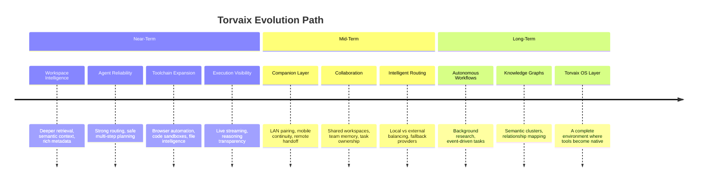
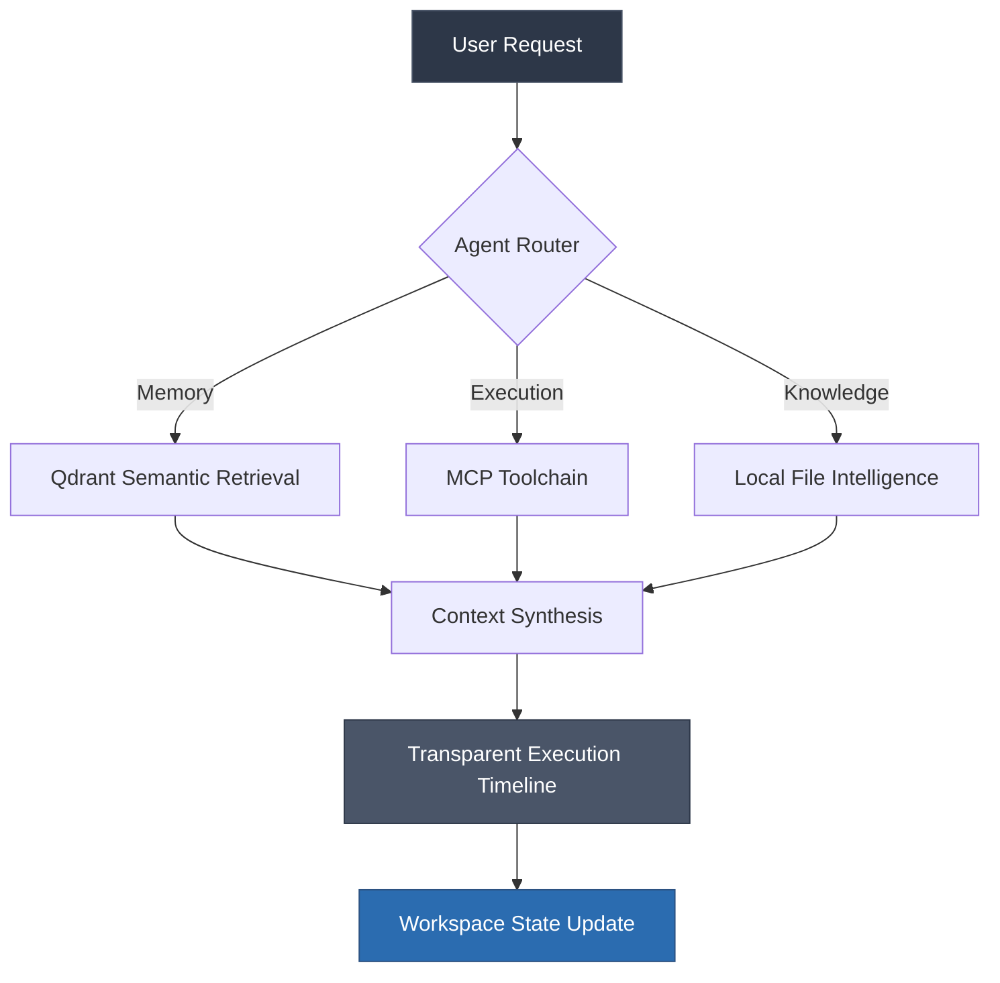

# The Torvaix Roadmap

Torvaix is still early, but the foundation is clear. Our goal is simple yet ambitious: to build a local-first AI operating system where memory compounds, agents coordinate seamlessly, and knowledge persists securely across all your work. 

What exists today is just the first layer. What comes next is about making that layer deeper, exponentially faster, and undeniably harder to replace. This document outlines our journey from a personal workspace to a true autonomous system.

> [!NOTE]
> This roadmap is a living document. As Torvaix evolves and as we learn more about how local-first AI shapes our daily workflows, our trajectory will naturally adapt.

---

## The Journey at a Glance

---

## Phase 1: The Foundation (Near-Term)

Our immediate priorities revolve around fortifying the local environment, ensuring that the existing mechanics of Torvaix are unbreakable and incredibly intuitive.

### Breathing Life into Workspace Intelligence
Workspaces are the beating heart of Torvaix. The next immediate step is elevating them from static environments to intelligent entities. We are focusing on cultivating a deeper long-term memory retrieval system powered by our Qdrant vector integration. By anchoring stronger semantic context building and robust document grounding, we aim to enrich workspace metadata. The ultimate vision is to ensure every workspace feels alive, cumulative, and deeply aware of your historical context.

### Engineering Agent Reliability
Torvaix already routes elegantly between memory, execution, and knowledge agents. Moving forward, we are sharpening this precision. This means architecting stronger routing decisions, building fail-safe fallback handling, and ensuring safe multi-step planning. By improving context compression and failure recovery mechanisms, our agents will transition from feeling experimental to being entirely dependable digital partners.

### Expanding the Execution Toolchain
The Model Context Protocol (MCP) layer is merely the prologue. We are aggressively expanding our toolchain to include seamless browser automation, structured API integrations, and profound local file intelligence. Coupled with secure code execution sandboxes, Torvaix will evolve into a boundless extensible execution layer rather than just a conversational interface.

### Unveiling Real-Time Execution
Agent execution should never be a black box. We are introducing transparent, real-time execution visibility. Expect live tool streaming, comprehensive execution timelines, and reasoning visibility that exposes the "thought process" of your agents. With added tool status indicators and immediate interruption controls, you will always remain the absolute conductor of your operating system.

---

## Phase 2: The Expansion (Mid-Term)

Once the local foundation is impenetrable, we will push Torvaix beyond the confines of a single local workspace.

### The Companion Bridge
Torvaix will introduce a lightweight companion layer designed to bridge trusted devices. This architecture will enable secure LAN pairing, allowing for seamless mobile workspace continuity and remote session handoffs. Imagine leaving your desk and instantly accessing your Torvaix memory on your phone—one central Torvaix node powering multiple trusted surfaces securely.

### Multiplayer Collaboration
Workspaces should not remain solitary forever. We are architecting a future where Torvaix scales from personal productivity to team workflows. This involves engineering shared workspaces, collaborative team memory layers, and agents that can take ownership of tasks within a group. Your execution logs and knowledge graphs will become assets you can securely share with trusted peers.

### Intelligent Model Routing
Not every task demands the same computational weight. We are building an intelligent routing layer that automatically balances execution between highly capable external providers and local on-device models. Through task-aware model selection, automated fallback providers, and latency-aware execution profiling, Torvaix will always choose the optimal brain for the job without requiring manual intervention.

---

## Phase 3: The Operating System (Long-Term)

This is the horizon where Torvaix transforms from an application into a complete paradigm shift.

### Perpetual Autonomous Workflows
We envision persistent agents that operate autonomously, far beyond the confines of a chat window. These operators will conduct extensive background research, process your inboxes, and relentlessly index your local knowledge base. Through scheduled execution and event-driven workflows, your agents will continue working and compiling context even when you have stepped away from the screen.

### Living Knowledge Graphs
Memory must evolve from linear logs into deeply connected knowledge. We are planning a fundamental shift towards linked memory nodes and intricate relationship mapping. By building semantic clusters and achieving project-level intelligence, Torvaix won't just remember what you did—it will understand the intricate web of why and how your projects connect. 

### The Torvaix OS Layer
This is the final vision. A true AI operating system where workspaces transcend into fully immersive environments, agents graduate to autonomous operators, and memory becomes the fundamental infrastructure of your machine. In this future, tools are completely native, and Torvaix is no longer just a digital assistant.

It is a system.

> [!IMPORTANT]  
> **Not just remembering. Understanding.**

---

## Help Wanted

Torvaix is still growing, and we are actively looking for visionaries who want to shape the future of computing. 

If you care deeply about:
* Local-first, privacy-native software
* Graph-based memory systems
* Multi-agent orchestration
* Expanding the MCP tooling ecosystem

There is a massive amount of meaningful work to be done. We are redefining how humans interact with their machines. 

**And this is only the beginning.**
