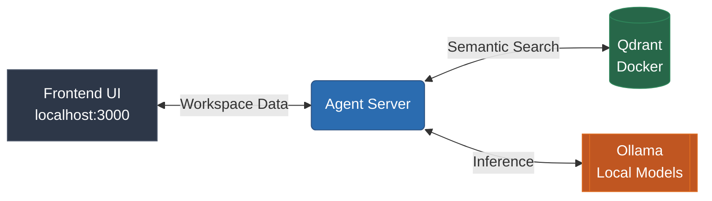

# Torvaix Setup Guide

Welcome to the **Torvaix Setup Guide**. 

Torvaix is engineered from the ground up to be a **local-first** AI operating system. We believe your memory, knowledge graphs, and agent executions should reside exclusively on your own hardware. 

The philosophy is simple: **clone → install → start services → run.**

For contribution guidelines, see [`CONTRIBUTING.md`](CONTRIBUTING.md).  
For security recommendations, see [`SECURITY.md`](SECURITY.md).

---

## 🖥️ Requirements

Before diving in, ensure your environment is prepared. 

> [!IMPORTANT]
> Because Torvaix relies on local model inference and vector storage, hardware capabilities directly impact performance.

**Required:**
* **Node.js** 20+
* **npm** 10+
* **Docker** & Docker Compose
* **Ollama** (for local model inference)

**Recommended Hardware:**
* **16GB+ RAM** (crucial for smooth local LLM execution)
* **Local Model Support** (GPU acceleration highly recommended)
* **SSD Storage** (for low-latency embeddings and memory retrieval)

---

## 🚀 Quick Start

Getting Torvaix running takes only a few commands.

### 1. Clone the repository
Pull the latest source code to your machine:
```bash
git clone https://github.com/Yashasm18/Torvaix.git
cd Torvaix
```

### 2. Install dependencies
Install all required Node packages across the monorepo:
```bash
npm install
```

### 3. Start local services
Boot up the vector database and internal services:
```bash
docker compose up -d
```
> [!NOTE]
> This spins up **Qdrant** (our semantic memory vector store) alongside necessary backend supporting services.

### 4. Start Ollama
Start your local inference engine:
```bash
ollama serve
```
If you don't have the model downloaded yet, pull it in a separate terminal:
```bash
ollama pull llama3.2
```

### 5. Run Torvaix
Launch the complete OS environment:
```bash
npm run dev
```
Torvaix will orchestrate the startup sequence and automatically open your workspace at:
`http://localhost:3000`

---

## 🏗️ Architecture: What Starts?

When you run Torvaix, a deeply integrated local stack spins up:



* **Frontend (`localhost:3000`)**: Your primary workspace UI where you interact with agents.
* **Agent Server**: Runs in the background managing multi-agent orchestration, memory retrieval, execution flow, and tool routing.
* **Qdrant**: Powered by Docker, this is the brain for long-term semantic memory and document embeddings.
* **Ollama**: Your local AI engine handling reasoning and execution planning.

---

## 🧪 First Run & Recommended Test Flow

Once Torvaix is running, we recommend a standard sequence to ensure your local OS is fully operational. 

> [!TIP]
> On your first run, create a workspace and start a conversation. You will be prompted to approve dangerous actions (like file modifications) before they execute—this is intentional security.

### 1. Test Memory Storage
```text
Remember that my favorite framework is Next.js
```

### 2. Test Memory Retrieval
```text
What is my favorite framework?
```
*(This verifies that Qdrant and your embedding models are syncing correctly.)*

### 3. Test Tool Execution
```text
Create a hello.py file and print Hello World
```

### 4. Test Security Gating
```text
Delete all files in this workspace
```
*(This should immediately trigger a security approval gate. Do not approve it unless you want an empty workspace!)*

---

## 🛠️ Troubleshooting

If you hit a snag, check these common local-first development issues:

### Port already in use
If port `3000` is occupied by another process:
```bash
# Find the process
lsof -i :3000

# Kill it
kill -9 <PID>

# Restart Torvaix
npm run dev
```

### Ollama not detected
If the agent server is failing to reason:
```bash
ollama list
```
*Ensure `ollama serve` is running in a background terminal and your selected model is downloaded.*

### Qdrant not running
If memory retrieval is failing:
```bash
# Check if the container is up
docker ps

# If not, force restart the services
docker compose up -d
```

### Memory not retrieving
Verify the trifecta:
1. **Ollama** embeddings are actively running.
2. **Qdrant** docker container is healthy.
3. Your **Workspace** is currently active in the UI.

---

## 🌐 Local Network Access (Optional)

By default, Torvaix is bound to `localhost`. To access your workspace from another trusted device on your network (like an iPad or laptop):

1. Expose the server to `0.0.0.0:3000`.
2. **Crucial Security Warnings:**
   * Only do this on a **trusted LAN**.
   * Place it behind authentication.
   * **Never expose Torvaix publicly** without HTTPS and robust access controls.

> [!CAUTION]
> Torvaix has direct access to your local filesystem and execution environments. Exposing it irresponsibly gives external users terminal-level access to your machine.

---

## 🔄 Updating Torvaix

To keep your local OS up to date:

```bash
git pull
npm install
docker compose up -d --build
npm run dev
```

---

<div align="center">
  <p><b>Your data belongs to you. Keep it local.</b></p>
</div>
